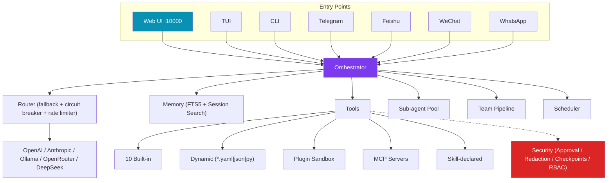

# Pulse — Self-improving AI Agent (Reliability-First)

[](https://github.com/Alex663028/pulse-agent/actions/workflows/ci.yml)
[](https://github.com/Alex663028/pulse-agent)
[](https://python.org)
[](LICENSE)
[](https://github.com/Alex663028/pulse-agent/releases/tag/v0.7.0)

A **self-improving personal AI agent** with a reliability-first core. Fully self-hostable by default — Ollama + SQLite FTS5, zero cloud dependency.

---

## Features

| Feature | Detail |
|---------|--------|
| **Web UI** | React SPA on port **10000** — browser-based chat, sessions, tools, skills (no build step) |
| **Security** | Shell command approval (manual/smart/off), secret redaction, filesystem checkpoints, RBAC |
| **Multi-Profile** | Isolated configs/sessions/skills per profile via `PULSE_PROFILE` env var |
| **Streaming** | `--stream` flag for real-time token output; tool-call events shown inline |
| **Social Gateways** | Telegram (long-polling), Feishu, WeChat, WhatsApp (webhook) |
| **10 Built-in Tools** | web_search, web_fetch, write_file, edit_file, python_exec, shell_exec, http_client + read/list/dir/calc |
| **Dynamic Tools** | Drop `.yaml`, `.json`, `.py` into `~/.pulse/tools/` — auto-registered at startup |
| **Executable Skills** | Skills can declare tools, self-test, hot-reload — `BaseExecutableSkill` + `SkillHandle` |
| **Session Memory** | Multi-turn conversations; FTS5 cross-session search; session-scoped recall |
| **Streaming Output** | `Orchestrator.run_stream()` yields token chunks; TUI shows live spinner |
| **Plan→Execute→Verify** | System prompt drives step-by-step planning with `DANGEROUS_TOOLS` audit |
| **Feedback Loop** | `add_correction("always use type hints")` → remembered in future system prompts |
| **Reliability-first** | Every LLM/tool call wrapped in classified error recovery + exponential backoff + hard token budget guardrail |
| **Circuit Breaker** | Per-provider circuit breaker (5 failures → 30s cooldown); automatic failover |
| **Provider Fallback** | Ollama → OpenRouter → Anthropic chain + token-bucket rate limiter |
| **Skill Evaluation** | Golden-task replay before promote/quarantine/rollback; immutable content snapshots |
| **Skill Curator** | Background maintenance for agent-created skills (stale detection, archive) |
| **Usage Analytics** | `pulse insights` — sessions, tokens, success rate, top skills |
| **RAG Pipeline** | Document ingestion, chunking, vector search (SQLite FTS5) |
| **Observability** | Structured traces to LangSmith/LangFuse |
| **Self-Evolution** | `pulse evolve analyze` — detects failure patterns, skill gaps, prompt drift; proposes improvements |
| **File Logging** | `~/.pulse/logs/pulse.log` with daily rotation (7 days retained) |
| **Container Ready** | Dockerfile + Makefile; health check on port 8080/10000 |

---

## Quick Start

### Option 1: Install from GitHub (recommended)

```bash
pip install git+https://github.com/Alex663028/pulse-agent.git
```

### Option 2: Clone and install locally

```bash
git clone https://github.com/Alex663028/pulse-agent.git
cd pulse-agent
pip install -e .
# or: pip install -e ".[dev]"  # for development
```

### Option 3: Using Makefile

```bash
git clone https://github.com/Alex663028/pulse-agent.git
cd pulse-agent
make install
```

### First run

```bash
# Zero-config (local Ollama — no API key needed)
pulse init --yes --provider ollama --model qwen2.5:7b

# Or use any OpenAI-compatible API
pulse init --yes --provider openai --model gpt-4o

# Web UI (React SPA, no build step)
pulse web start              # http://127.0.0.1:10000

# Interactive TUI
pulse tui

# Streaming chat
pulse chat "hello" --stream

# Self-check
pulse doctor
```

---

## Architecture



---

## Commands

| Command | Description |
|---------|-------------|
| `pulse web start` | Web UI dashboard on port **10000** |
| `pulse tui` | Interactive terminal chat with live streaming |
| `pulse chat <task>` | One-shot task (add `--stream` for real-time output) |
| `pulse serve` | Start all gateways + web UI + scheduler |
| `pulse fork <task>` | Decompose into parallel sub-agents with recursive recovery |
| `pulse team <task>` | Multi-agent team (Builder → Reviewer → Ship) |
| `pulse skills list\|install\|eval\|promote\|rollback` | Skill lifecycle |
| `pulse mcp list\|add\|remove\|test\|export` | MCP server management |
| `pulse cron list\|add\|remove\|pause\|resume` | Cron scheduler |
| `pulse rl export` | Export trajectories for RL fine-tuning |
| `pulse insights` | Usage analytics (sessions, tokens, success rate) |
| `pulse insights curator` | Skill curator status and maintenance |
| `pulse profile list\|create\|switch` | Multi-profile management |
| `pulse evolve analyze\|status\|apply` | Self-evolution (pattern analysis & proposals) |
| `pulse health` | Health check endpoint |
| `pulse doctor` | Self-check |

---

## Dynamic Tools & Skills

### Add a tool via YAML (`~/.pulse/tools/weather.yaml`)
```yaml
name: get_weather
description: Get current weather for a city
command: "curl -s 'wttr.in/{city}?format=3' 2>/dev/null"
timeout: 10
parameters:
  type: object
  properties:
    city: {type: string}
  required: [city]
```

### Add a skill with tools (`skills/my-skill/runner.py`)
```python
from pulse.tools.base import Tool, ToolResult

class MyTool(Tool):
    name = "my_tool"
    description = "Do something useful"
    parameters = {"type": "object", "properties": {"text": {"type": "string"}}, "required": ["text"]}
    def run(self, text: str = "", **kwargs):
        return ToolResult(ok=True, output=f"Processed: {text}")

def get_tools():
    return [MyTool()]

def execute(**kwargs):
    return "Skill executed"

def test() -> list[str]:
    return []  # empty = pass
```

---

## Social Media Gateways

| Platform | Setup |
|----------|-------|
| **Telegram** | Long-polling; set `TELEGRAM_BOT_TOKEN` env var |
| **Feishu** | App credentials → call `feishu.handle_webhook(body)` |
| **WeChat** | Token/AES key → verify signature in `wechat.handle_webhook(...)` |
| **WhatsApp** | Meta Cloud API → call `wa.handle_webhook(body, params)` |

---

## Security

Pulse provides four layers of defense:

**1. Command Approval** — dangerous shell commands require user confirmation:
- `manual` mode — prompt on `rm -rf`, `git reset --hard`, `chmod 777`, etc.
- `smart` mode — prompt only on destructive ops
- `off` — no prompts (YOLO)

**2. Secret Redaction** — API keys, bearer tokens, private keys are automatically redacted in tool output.

**3. Filesystem Checkpoints** — snapshot files before destructive operations; restore on failure.

**4. RBAC** — role-based access control with predefined roles (viewer/operator/developer/admin/auditor).

Configure in `~/.pulse/config.yaml`:
```yaml
approval_mode: manual  # off | manual | smart
redact_secrets: true
```

---

## Multi-Profile

Run multiple isolated instances (separate config, sessions, skills, memory):

```bash
pulse profile list            # show all profiles
pulse profile create work     # create "work" profile
PULSE_PROFILE=work pulse chat "hello"  # use work profile
```

---

## Streaming

Real-time token output as the LLM responds:

```bash
pulse chat "write a long article" --stream
```

The `--stream` flag shows tokens as they arrive and displays tool-call events inline.

---

## Self-Evolution

The agent analyzes its own runtime patterns to detect:
- **Repeated tool failures** (proposes fixes)
- **Frequent task patterns** (proposes new skills)
- **Inefficient trajectories** (proposes prompt refinements)

```bash
pulse evolve analyze          # detect patterns and list proposals
pulse evolve status           # show current signal counts
pulse evolve apply N          # apply a specific proposal
```

---

## Running Tests

```bash
pip install -e ".[dev]"
python -m pytest -q
```

Tests cover: basic interaction, memory persistence, multi-tool tasks, error handling, streaming, feedback learning, builtin tools, gateway signature verification, skill rollback, security approval, secret redaction, RBAC, audit logging.

---

## Version History

| Version | Release Date | Key Changes |
|---------|-------------|-------------|
| v0.7.0 | 2025-07-18 | Enterprise RBAC, audit logging, SSO stub, i18n (en/zh) |
| v0.6.1 | 2025-07-17 | Security redaction, command approval, checkpoints, session search, curator, analytics |
| v0.6.0 | 2025-07-17 | Circuit breaker, optimistic lock, async, tool filtering, React SPA |
| v0.5.2 | 2025-07-15 | Social gateways (Feishu/WeChat/WhatsApp), dynamic tools, recursive sub-agents |
| v0.5.1 | 2025-07-15 | Dockerfile, E2E tests, file logging, plugin sandbox |
| v0.5.0 | 2025-07-15 | Web UI, streaming, session memory, feedback loop |
| v0.4.1 | 2025-07-15 | P0-P2 reliability audit |
| v0.4.0 | 2025-07-15 | Anthropic, rate limiter, bad-response fallback |
| v0.3.0 | 2025-07-15 | Core orchestrator, memory, skill eval loop |

---

## License

Pulse is open-source software licensed under the **Apache License 2.0** (see [LICENSE](LICENSE)).

You are free to use, modify, and distribute this software in source and binary form, for any purpose — including commercial use — under the terms of the Apache License 2.0. See the license text for details.
