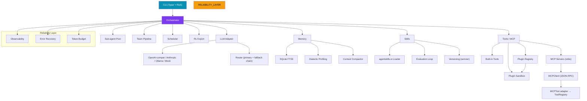
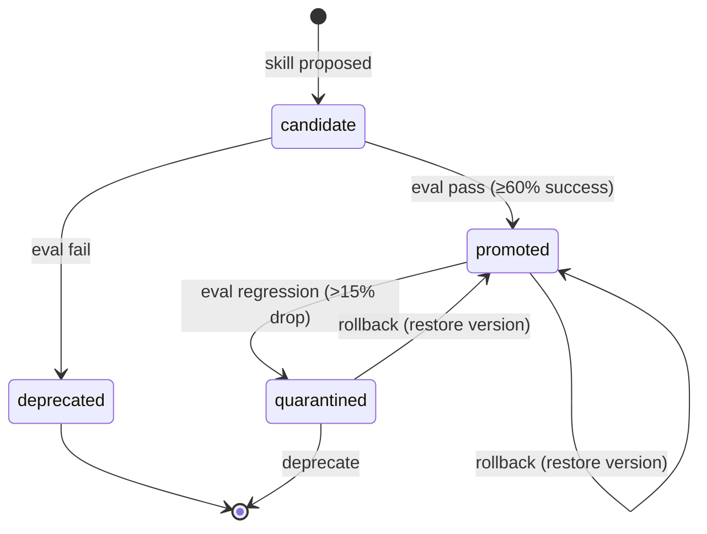

# Pulse — Self-improving AI Agent (Reliability-First)

[](https://github.com/Alex663028/pulse-agent/actions/workflows/ci.yml)
[](https://github.com/Alex663028/pulse-agent)
[](https://python.org)
[](LICENSE)
[](https://github.com/Alex663028/pulse-agent/releases/tag/v0.3.0)

A **self-improving personal AI agent** with a reliability-first core.
Compatible with the [agentskills.io](https://agentskills.io) open standard.
**Fully self-hostable by default** — Ollama + SQLite FTS5, zero cloud dependency.

---

## Why Pulse

| Advantage | Detail |
|---|---|
| **Reliability-first orchestration** | Every LLM/tool call wrapped in classified error recovery + exponential backoff + hard token budget guardrail |
| **Evaluated skill self-evolution** | Auto-generated skills must pass golden-task replay before promotion. `promote / quarantine / rollback` state machine with versioning |
| **Zero-config onboarding** | `pulse init --yes` with built-in Ollama detection, Rich visual feedback, starter skills, `pulse doctor` self-check |
| **Fully self-hosted** | Default Ollama + local SQLite FTS5; any cloud API is opt-in — no mandatory external service |
| **Multi-agent orchestration** | Sub-agent parallel pool with failure isolation + result merge; Builder→Reviewer→Ship team pipeline |
| **Dialectic user modeling** | Self-hosted replacement for Honcho — thesis → antithesis → synthesis profiling with versioned rollbacks |
| **Agentskills.io compatible** | Load and run skills from the ecosystem without modification |
| **Plugin sandbox** | Import isolation + permission whitelist; plugins declare `__permissions__` and run in restricted execution context |
| **RL training data pipeline** | Export execution trajectories in ChatML JSONL or ShareGPT format for fine-tuning |
| **Cron scheduling** | Natural-language scheduling (`"every 5 min"`, `"daily at 8am"`) + standard cron expressions + pause/resume with execution history |
| **MCP integration** | Connect any stdio Model Context Protocol server — its tools become first-class Pulse tools, zero SDK dependency |

---

## Quick Start

```bash
# 1. Install
pip install -e .

# 2. Zero-config (local Ollama — no API key needed)
pulse init --yes --provider ollama --model qwen2.5:7b

# 3. First conversation
pulse chat "write a Python sorting function"

# 4. Self-check
pulse doctor

# 5. Interactive TUI
pulse tui
```

**No Ollama?** Use the built-in mock provider for an offline demo:
```bash
pulse init --yes --provider mock
pulse chat "hello world"
```

---

## Architecture



### Skill Evaluation State Machine



### Multi-Agent Team Pipeline


---

## TUI Demo

```
╭──────────────────────────────────────────────────────────────────────────────╮
│ Pulse — Self-improving AI Agent                                              │
╰────────────────────────── type /help for commands ───────────────────────────╯
memory=107B  skills=1  provider=mock
           Slash Commands
┏━━━━━━━━━┳━━━━━━━━━━━━━━━━━━━━━━━━━┓
┃ Command ┃ Description             ┃
┡━━━━━━━━━╇━━━━━━━━━━━━━━━━━━━━━━━━━┩
│ /help   │ Show this help          │
│ /skills │ List available skills   │
│ /memory │ View memory notes       │
│ /model  │ Show current model info │
│ /clear  │ Clear session context   │
│ /quit   │ Exit TUI                │
└─────────┴─────────────────────────┘

You: write a Python function to sort a list
Pulse: Here is a function that sorts a list:
  def sort_list(lst):
      return sorted(lst)
```

---

## Commands

| Command | Description |
|---|---|
| `pulse init` | Zero-config setup wizard |
| `pulse doctor` | Self-check (Python / FTS5 / storage / Ollama reachable) |
| `pulse chat <task>` | One-shot task through the orchestrator |
| `pulse tui` | Interactive terminal chat (with slash commands) |
| `pulse serve` | Start all gateways + scheduler |
| `pulse fork <task>` | Decompose task → parallel sub-agents → merge |
| `pulse team <task>` | Multi-agent team (Builder → Reviewer → Ship) |
| `pulse skills list\|install\|eval\|promote\|rollback` | Skill lifecycle management |
| `pulse memory recall\|add\|profile` | Cross-session FTS5 memory + dialectic profiling |
| `pulse cron list\|add\|remove\|pause\|resume` | Cron job management |
| `pulse rl export` | Export trajectories for fine-tuning (JSONL / ShareGPT) |
| `pulse plugin list\|install\|activate` | Plugin system |
| `pulse mcp list\|add\|remove\|test\|export` | Model Context Protocol server management |

---

## Configuring LLM Providers

```bash
# Ollama (local, recommended)
pulse init --provider ollama --model qwen2.5:7b --yes

# OpenAI
pulse init --provider openai --model gpt-4o-mini --api-key sk-xxx --yes

# OpenRouter (200+ models)
pulse init --provider openrouter --model openai/gpt-4o-mini --api-key sk-xxx --yes

# DeepSeek
pulse init --provider deepseek --model deepseek-chat --api-key sk-xxx --yes
```

API keys are stored in `~/.pulse/.env` (never in config.yaml). Provider defaults to Ollama — no key required.

---

## Installing Skills from the Ecosystem

Pulse loads any skill that follows the [agentskills.io](https://agentskills.io) standard:

```bash
# From a local directory
pulse skills install ./examples/skills/research-paper-writing

# From a git repository
pulse skills install https://github.com/user/some-skill.git
```

---

## Skill Evaluation Loop (the key differentiator)

Every self-evolved skill MUST pass a golden-task replay before promotion.
Promotions and rollbacks are explicit, reversible, and versioned.

```bash
pulse skills eval my-candidate-skill       # evaluate against golden tasks
pulse skills promote my-candidate-skill     # bump version + set promoted
pulse skills rollback my-skill --to 1.0.0  # revert to a previous version
```

---

## Plugin Sandbox

Plugins run in an isolated execution context:

- **Import whitelist** — only safe stdlib + pulse public API modules allowed
- **Restricted builtins** — `open`, `eval`, `exec`, `compile`, `__import__` removed
- **Permission system** — plugins declare `__permissions__ = ["tools.register", "memory.read"]`

```python
# example plugin with sandbox
__permissions__ = ["tools.register"]

from pulse.tools.base import Tool, ToolResult

class MyTool(Tool):
    name = "my_tool"
    # ...

def register(runtime):
    runtime.tools.register(MyTool())
```

---

## Model Context Protocol (MCP)

Pulse can connect to **any stdio MCP server** and expose its tools to the orchestrator — no official SDK dependency, keeping the project lightweight and self-hosted. Tools from a server named `fs` become callable as `fs__<tool>` (prefixed to avoid name collisions).

```bash
# Add a server (tools are prefixed by the name you give it).
# Pass the whole command as one quoted string so flags like -y are preserved.
pulse mcp add fs "npx -y @modelcontextprotocol/server-filesystem /tmp"

# Verify it connects and see what tools it exposes
pulse mcp test fs

# Back up / share your server configs
pulse mcp export > mcp-servers.json

# Remove one
pulse mcp remove fs
```

Configured servers are stored in `~/.pulse/config.yaml` (never the `.env` secrets file). Interactive commands (`chat`, `tui`, `serve`, `fork`, `team`) wire MCP tools into the orchestrator automatically.

**How it works (reliability-first):**

- **Lazy, parallel discovery** — on startup Pulse probes every enabled server *in parallel* to fetch its tool list, then disconnects. Servers are only (re)spawned on demand, the first time one of their tools is actually invoked, so startup stays fast even with many servers.
- **Automatic reconnection** — if a server process crashes mid-session, the next tool call transparently reconnects.
- **Argument validation** — tool calls are checked against each server's `inputSchema` (required fields + JSON types) before being sent, so mistakes surface as clean errors instead of server-side failures.
- **`pulse mcp list`** shows a live health check per server: tool count and `ok` / `unreachable` status.

```bash
pulse mcp list     # live tool count + health per server
```

`pulse doctor` also probes each enabled MCP server so you can spot a broken config at a glance.

---

## Running Tests

```bash
pip install -e ".[dev]"
python -m pytest -q   # 130 tests, all pass
```

Tests cover: agentskills.io skill loading | evaluation loop (promote/deprecate/rollback) |
error classification + retry | context budget overflow | orchestrator fault tolerance |
sub-agent pool + error isolation | plugin discovery + activation (sandbox) |
dialectic profiling | RL trajectory export | team orchestration.

---

## Benchmarks

```bash
python scripts/benchmark.py --quick
```

| Benchmark | Metric | Mock (typical) |
|---|---|---|
| Orchestrator latency | mean | ~100ms |
| Token consumption | mean/task | ~24 tokens |
| Sub-agent throughput | tasks/sec (4 workers) | ~7,000 |
| Skill evaluation | mean | ~0.04ms |
| Memory recall (FTS5) | mean | ~0.37ms |

---

## Roadmap

- [x] **M1** — Core orchestrator, memory, skill eval loop, agentskills compat, CLI wizard
- [x] **M2** — Multi-platform gateways (TUI, Telegram) + scheduler
- [x] **M3** — Sub-agent parallel pool + cron enhancement
- [x] **M4** — RL trajectory export + dialectic user modeling
- [x] **M5** — Plugin system + multi-agent team orchestration
- [x] **P0** — Version consistency, CI/CD, real badges, CHANGELOG
- [x] **P1** — Test coverage boost, exception narrowing, docstrings, CONTRIBUTING/Docker/Makefile
- [x] **P2** — Plugin sandbox, .env chmod 600, benchmark scripts, Mermaid diagrams + TUI screenshots

---

## License

Apache 2.0 — see [LICENSE](LICENSE).
