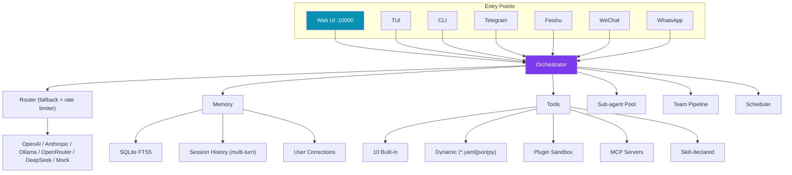

# Pulse — Self-improving AI Agent (Reliability-First)

[](https://github.com/Alex663028/pulse-agent/actions/workflows/ci.yml)
[](https://github.com/Alex663028/pulse-agent)
[](https://python.org)
[](LICENSE)
[](https://github.com/Alex663028/pulse-agent/releases/tag/v0.5.2)

A **self-improving personal AI agent** with a reliability-first core.
Compatible with the [agentskills.io](https://agentskills.io) open standard.
**Fully self-hostable by default** — Ollama + SQLite FTS5, zero cloud dependency.

---

## Features

| Feature | Detail |
|---------|--------|
| **Web UI** | Session management dashboard on port **10000** — browser-based chat, tool listing, settings |
| **Social Gateways** | Feishu, WeChat, WhatsApp — async webhook-based bridges to external chat platforms |
| **10 Built-in Tools** | web_search, web_fetch, write_file, edit_file, python_exec, shell_exec, http_client + original read/list/dir/calc |
| **Dynamic Tools** | Drop `.yaml`, `.json`, `.py` into `~/.pulse/tools/` — auto-registered at startup |
| **Executable Skills** | Skills can declare tools, self-test, hot-reload — `BaseExecutableSkill` + `SkillHandle` |
| **Session Memory** | Multi-turn conversations within same session; previous turns auto-injected as context |
| **Streaming Output** | `Orchestrator.run_stream()` yields token chunks; TUI shows live spinner |
| **Plan→Execute→Verify** | System prompt drives step-by-step planning with `DANGEROUS_TOOLS` audit |
| **Feedback Loop** | `add_correction("always use type hints")` → remembered in future system prompts |
| **Reliability-first** | Every LLM/tool call wrapped in classified error recovery + exponential backoff + hard token budget guardrail |
| **Provider Fallback** | Ollama → OpenRouter → Anthropic chain + token-bucket rate limiter |
| **Skill Evaluation** | Golden-task replay before promote/quarantine/rollback; only complex multi-tool tasks trigger evolution |
| **File Logging** | `~/.pulse/logs/pulse.log` with daily rotation (7 days retained) |
| **Container Ready** | Dockerfile + `.dockerignore`; health check on port 8080/10000 |

---

## Quick Start

```bash
# 1. Install
pip install -e .
# or: pip install -r requirements.txt
# Dev: pip install -r requirements-dev.txt

# 2. Zero-config (local Ollama — no API key needed)
pulse init --yes --provider ollama --model qwen2.5:7b

# 3. Web UI (browser-based dashboard)
pulse web start              # http://127.0.0.1:10000
pulse web start --token SITE_SECRET   # enable bearer auth

# 4. Interactive TUI
pulse tui

# 5. Start everything (gateways + web + cron)
pulse serve --gateway telegram --gateway feishu

# 6. Self-check
pulse doctor
```

**No Ollama?** Use the built-in mock provider for an offline demo:
```bash
pulse init --yes --provider mock
pulse chat "hello world"
```

---

## Architecture



---

## Commands

| Command | Description |
|---------|-------------|
| `pulse web start` | Web UI dashboard on port **10000** (add `--token SITE_SECRET` to enable auth) |
| `pulse tui` | Interactive terminal chat with live streaming |
| `pulse chat <task>` | One-shot task |
| `pulse serve` | Start all gateways + web UI + scheduler |
| `pulse fork <task>` | Decompose into parallel sub-agents with recursive recovery |
| `pulse team <task>` | Multi-agent team (Builder → Reviewer → Ship) |
| `pulse skills list\|install\|eval\|promote\|rollback` | Skill lifecycle |
| `pulse tools list\|reload` | Dynamic tool management |
| `pulse mcp list\|add\|remove\|test` | MCP server management |
| `pulse cron list\|add\|remove\|pause\|resume` | Cron scheduler |
| `pulse health --port 8080` | Health check endpoint |
| `pulse doctor` | Self-check |

---

## Dynamic Tools & Skills

### Add a tool via YAML (`~/.pulse/tools/weather.yaml`)
```yaml
name: get_weather
description: Get current weather for a city
command: "curl -s 'wttr.in/{city}?format=3' 2>/dev/null"
timeout: 10
parameters:
  type: object
  properties:
    city: {type: string}
  required: [city]
```

### Add a skill with tools (`skills/my-skill/runner.py`)
```python
from pulse.tools.base import Tool, ToolResult

class MyTool(Tool):
    name = "my_tool"
    description = "Do something useful"
    parameters = {"type": "object", "properties": {"text": {"type": "string"}}, "required": ["text"]}
    def run(self, text: str = "", **kwargs):
        return ToolResult(ok=True, output=f"Processed: {text}")

def get_tools():
    return [MyTool()]

def execute(**kwargs):
    return "Skill executed"

def test() -> list[str]:
    return []  # empty = pass
```

---

## Social Media Gateways

| Platform | Setup |
|----------|-------|
| **Feishu** | App credentials → call `feishu.handle_webhook(body)` |
| **WeChat** | Token/AES key → verify signature in `wechat.handle_webhook(...)` |
| **WhatsApp** | Meta Cloud API → call `wa.handle_webhook(body, params)` |

All gateways are webhook-based — mount in your Flask/FastAPI, no polling needed.

---

## Running Tests

```bash
pip install -r requirements-dev.txt
python -m pytest -q
```

Tests cover: basic interaction, memory persistence, multi-tool tasks, error handling, streaming, feedback learning, builtin tools, gateway signature verification.

---

## Roadmap

| Phase | Status |
|-------|--------|
| M1 — Core orchestrator, memory, skill eval loop | ✅ |
| M2 — Multi-platform gateways + scheduler | ✅ |
| M3 — Sub-agent parallel pool + cron | ✅ |
| M4 — RL trajectory export + dialectic user modeling | ✅ |
| M5 — Plugin system + multi-agent team | ✅ |
| v0.4.0 — Anthropic, rate limiter, bad-response fallback | ✅ |
| v0.4.1 — P0-P2 reliability audit | ✅ |
| v0.5.0 — Web UI, streaming, session memory, feedback loop | ✅ |
| v0.5.1 — Dockerfile, E2E tests, file logging, plugin sandbox | ✅ |
| v0.5.2 — Social gateways (Feishu/WeChat/WhatsApp), dynamic tools, recursive sub-agents | ✅ |

---

## License

Apache 2.0 — see [LICENSE](LICENSE).
