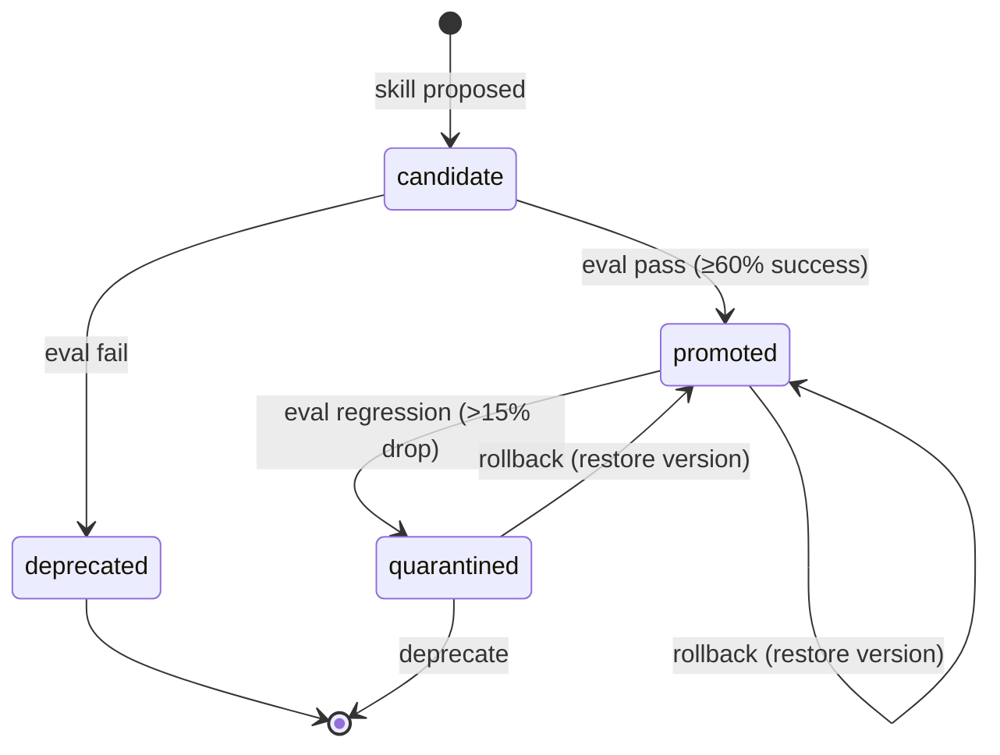
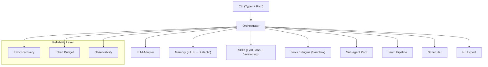

# 我重写了 Hermes Agent，专门修掉了它的 4 个硬伤

> 一个可靠性优先、可自进化的开源 AI Agent —— Pulse，已发布 v0.2.0

## 为什么又造一个 Agent？

Hermes Agent（Nous Research 出品）是个很有想法的开源自进化 Agent：内置学习循环、跨会话记忆、cron 调度、子代理并行。但真实使用下来，它有 4 个绕不开的坑：

| Hermes 的硬伤 | 现象 |
|---|---|
| **可靠性差** | 780+ open issues，一个未捕获的 LLM 超时就能让整轮对话崩掉 |
| **技能质量没验证** | "自动生成技能更好" 是口头承诺，实际生成的技能可能越用越烂 |
| **上手门槛高** | 配置项一大堆，新手看到 YAML 就劝退 |
| **云依赖重** | 用户建模用的 Honcho 是云服务，数据得出境 |

于是我用 **Python CLI + 自研轻量核心 + 兼容 agentskills.io 生态** 的方式，重做了一个：**Pulse**。

> 仓库：https://github.com/Alex663028/pulse-agent
> 协议：Apache 2.0（商用友好）

---

## 30 秒上手

```bash
pip install -e .

# 零配置：默认本地 Ollama，无需任何 API Key
pulse init --yes --provider ollama --model qwen2.5:7b

# 第一次对话
pulse chat "写一个 Python 排序函数"

# 自检
pulse doctor

# 交互式 TUI
pulse tui
```

没有 Ollama？一行切到内置 mock 模式，离线就能跑完整 demo：

```bash
pulse init --yes --provider mock
pulse chat "hello world"
```

---

## 核心差异化特性

### 1. 可靠性优先的编排核心

每个 LLM / 工具调用都被包裹在**错误分类 + 指数退避 + Token 预算护栏**里：

```python
from pulse.orchestrator.recovery import classify, guarded

# 错误被分类为 TRANSIENT / TOOL_FAIL / CTX_OVERFLOW / LLM_REFUSE
# 只有允许重试的错误类型才会退避重试，不会无限循环
result = guarded(runtime.router.chat, messages, max_retries=3)
```

Token 预算有软阈值（80% 触发压缩）和硬上限（超限直接抛 `CtxOverflowError`）。**一个工具超时，绝不会把整个会话拖垮。**

### 2. 经过评估的技能自进化（关键差异点）

这是 Pulse 最核心的设计 —— **自动生成的技能必须先通过 golden-task 回放，才能晋升**。



```bash
pulse skills eval my-candidate-skill       # 用黄金任务集评估
pulse skills promote my-candidate-skill     # 晋升 + 版本号 bump
pulse skills rollback my-skill --to 1.0.0  # 回滚到旧版本
```

晋升、回滚、隔离都是显式、可逆、带版本号的。**技能越用越烂这件事，从架构上被堵死了。**

### 3. 完全自托管（默认零云依赖）

默认栈就是 **Ollama + SQLite FTS5**，任何云 API 都是 opt-in：

```bash
# 想用云端模型也行，但非必须
pulse init --provider openai --model gpt-4o-mini --api-key sk-xxx --yes
```

API Key 只存进 `~/.pulse/.env`，而且我们会自动 `chmod 600`：

```python
# pulse/cli/init_wizard.py
path.write_text(...)
os.chmod(path, 0o600)  # 只有 owner 能读写
```

### 4. 多智能体编排

- **子代理并行池**：`ThreadPoolExecutor` + 每任务超时 + Token 预算 + 错误隔离。一个子任务挂了，兄弟任务不受影响。
- **团队流水线**：Builder → Reviewer → Ship，带 handoff 协议。

```bash
pulse fork "分析 Python 异步模式，对比 asyncio vs trio"   # 并行分解
pulse team "写一份最佳实践总结"                              # 多 Agent 协作
```

### 5. 辩证用户建模（替代 Honcho）

自托管的用户建模引擎，用 **thesis → antithesis → synthesis** 三段式构建用户画像，带版本快照和回滚 —— 不依赖任何云服务。

```bash
pulse memory profile reflect "用户更喜欢简洁的代码示例"
pulse memory profile history     # 查看历史版本
pulse memory profile rollback   # 回滚到上一版
```

### 6. 插件沙箱（安全隔离）

插件运行在受限执行上下文中，import 和 builtins 都被白名单限制：

```python
# example plugin
__permissions__ = ["tools.register"]

from pulse.tools.base import Tool, ToolResult

class MyTool(Tool):
    name = "my_tool"
    # ...

def register(runtime):
    runtime.tools.register(MyTool())
```

沙箱三层防护：① 受限 `__builtins__`（移除 `open/eval/exec/compile`）；② `sys.meta_path` finder 拦截危险 import；③ `sys.modules` 缓存驱逐（但保留 import 系统自身必需的模块）。

```bash
pulse plugin list       # 列出已发现插件
pulse plugin activate   # 激活插件（沙箱内执行）
```

---

## 架构全景



---

## 性能数据（mock provider）

`python scripts/benchmark.py --quick` 一键出报告：

| Benchmark | 指标 | 典型值 |
|---|---|---|
| Orchestrator 延迟 | mean | ~100ms |
| Token 消耗 | mean/task | ~24 tokens |
| 子代理吞吐 | tasks/sec（4 workers） | ~7,000 |
| 技能评估 | mean | ~0.04ms |
| 记忆召回（FTS5） | mean | ~0.37ms |

---

## 当前状态

- ✅ 107 个测试全部通过（Python 3.11 / 3.12 双版本 CI 绿）
- ✅ 73% 测试覆盖率，75% docstring 覆盖率
- ✅ v0.2.0 已发布（含插件沙箱、`.env` 安全、benchmark、Mermaid 文档）
- ✅ Apache 2.0 协议

## 路线图

- [x] M1–M5：核心编排 / 网关 / 子代理 / RL 导出 / 插件系统
- [x] P0–P2：版本一致性 / 测试增强 / 沙箱与安全
- [ ] 下一步：MCP 协议支持、Web UI、技能市场

---

## 试试看？

```bash
git clone https://github.com/Alex663028/pulse-agent
cd pulse-agent
pip install -e .
pulse init --yes --provider ollama --model qwen2.5:7b
pulse chat "帮我写一个快速排序"
```

如果你也在用 Hermes 或者自己在搭 Agent，欢迎来提 issue / PR，一起把"可靠性优先的自进化 Agent"这件事做扎实。

**Star 一下不迷路：** https://github.com/Alex663028/pulse-agent
